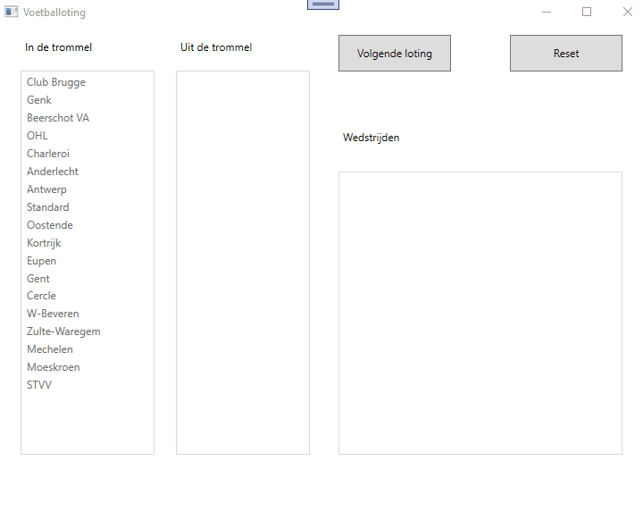

# Lussen en collecties : oefening 4 

Nadat je de code hebt binnengehaald bestudeer je eerst even de controls die zich op het venster bevinden zodat je weet welke controls er zijn en hoe ze heten.  

Vooraleer je begint te programmeren, bekijk aandachtig deze korte demo : 

  

Alle event-handlers en methoden zijn reeds aangemaakt.  
In de code behind vind je bovenaan 3 globale variabelen (Lists) waar je mee moet verderwerken.  
In het Window_Loaded event wordt de List ploegenBeschikbaar reeds gevuld met alle voetbalploegen uit de eerste klasse.  
Je dient er zelf nog voor te zorgen dat via methode VulListboxen() (reeds aanwezig, maar zonder code) de listboxen gevuld worden :    
  * lstBeschikbaar wordt gevuld met de List ploegenBeschikbaar  
  * lstGekozen wordt gevuld met de List ploegenGeloot  
  * lstMatchen wordt gevuld met de List wedstrijden  
    
Wanneer op btnLoot wordt geklikt dienen 2 willekeurige (nog beschikbare) ploegen geselecteerd te worden in de List ploegenBeschikbaar en dienen deze toegevoegd te worden aan de List ploegenGeloot en aan de List wedstrijden (bekijk de demo hiervoor).  Uiteraard dienen deze 2 ploegen uit de List ploegenBeschikbaar gehaald te worden.  

Je kan dit herhalen door opnieuw op de knop btnLoot te klikken, en dit tot er geen ploegen meer zijn in de List ploegenBeschikbaar.   
Zijn er geen ploegen meer beschikbaar, dan wordt de knop btnLoot uitgeschakeld.  
  
Klik je op btnReset, dan worden de 3 Lists terug leeggemaakt en wordt de List ploegenBeschikbaar opnieuw gevuld met de gegevens zoals bij de start van het programma.  Vergeet ook niet om eventueel de knop btnLoot opnieuw actief te maken.  
